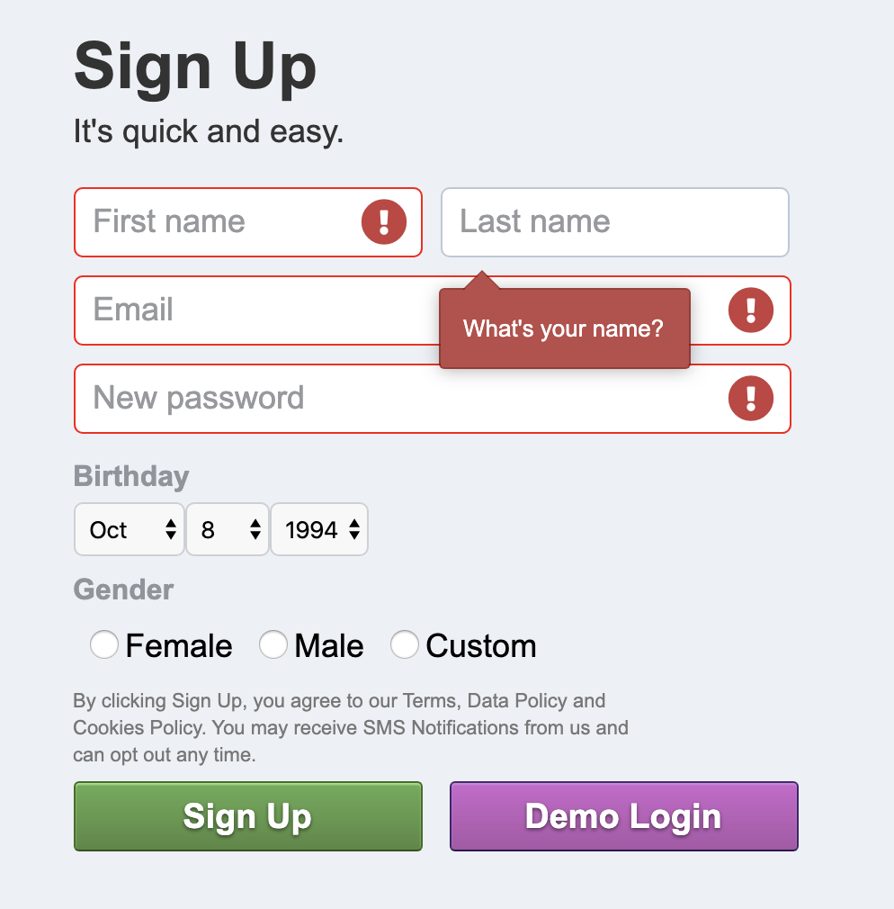

# Bacefook

[Live site](http://thebacefook.herokuapp.com/)

# Description

Bacefook is a social media platform that allows people to connect with anyone and post images and .

# Technologies

  * Ruby on Rails
  * JavaScript
  * PostgreSQL
  * React
  * Redux
  * Amazon Web Services S3
  * Webpack
  * jQuery
  * HTML / CSS
    
# Features

## Profile

Users can setup their profiles with a cover picture, profile picture, and make posts on their timeline.


## Newsfeed

The newsfeed holds all the latest posts of friends


Using the friendship model we can find all of the friends of the logged in user and search for all the posts that have been authored by the logged in user and their friends.

```
def newsfeed
    friend_ids = Friendship.where("accepted = true AND (requested_id = ? OR requester_id = ?)", current_user.id, current_user.id)
    .map { |friendship| 
      if friendship.requested_id == current_user.id
        friendship.requester.id
      else
        friendship.requested.id
      end
    }
    @posts = Post.where("author_id = #{current_user.id} OR timeline_owner_id = #{current_user.id} #{ friend_ids.length > 0 ? " OR author_id IN ?" : ''}", friend_ids).includes(:likes, :likers)
    render :index
  end
```

## Signup Assistance

The sign up form provides tool-tip assistance to bring attention to fields that need to be corrected in order to sign up.



In order to keep track of each individual error as soon as the error is noticeable even before the form is submitted it is important to keep track of the current focused field and the errors of fields in order to display them to the user.

```
this.state = this.props.formType === 'Log In' ? {
            email: '',
            password: ''
        } : {
            email: '',
            password: '',
            first_name: '',
            last_name: '',
            birth_date: '1994-10-08',
            gender: '',
            custom: false,
            errors: {},
            focused: {},
            email_message_flip: false
        };
```

Because of this system where we don't rely on the submission response, but instead real-time errors after a user exits an input field, it was necessary to trigger all of the fields for evaluation of potential errors on submission.

```
handleSubmit(e) {
        e.preventDefault();
        const user = Object.assign({}, this.state);
        if (this.props.formType === 'Sign Up') {
            delete user['custom'];
            delete user['errors'];
            delete user['focused'];
            delete user['email_message_flip'];
        }
        if (this.props.formType === 'Sign Up') {
            this.handleSignupError('first_name', 
                () => this.handleSignupError('last_name',
                    () => this.handleSignupError('email',
                        () => this.handleSignupError('password')({ target: { value: this.state.password } })
                    )({ target: { value: this.state.email } })
                )({ target: { value: this.state.last_name } })
            )({ target: { value: this.state.first_name }});
        }
        this.props.processForm(user)
    }
```

In this code snippet I took advantage of the React.setState function's callback capability so I can synchronously check each field individually and make sure all of them display by the time it finishes.

```
handleSignupError(field, callback) {
        return e => {
            this.disableFocus();
            let input = e.target.value;
            let newErrors = Object.assign({},this.state.errors);
            switch (field) {
                case "first_name":
                    if (!this.state.errors.first_name) {
                        if (input.length === 0) {
                            newErrors["first_name"] = "What's your name?";
                        }
                    } else {
                        if (input.length > 0) {
                            delete newErrors["first_name"];
                        }
                    }
                    this.setState({ errors: newErrors }, callback);
                    break;
                case "last_name":
                    if (!this.state.errors.last_name) {
                        if (input.length === 0) {
                            newErrors["last_name"] = "What's your name?";
                        }
                    } else {
                        if (input.length > 0) {
                            delete newErrors["last_name"];
                        }
                    }
                    this.setState({ errors: newErrors }, callback);
                    break;    
                case "email":
                    let validEmailRegex = /\S+@\S+\.\S+/;
                    if (!this.state.errors.email) {
                        if (input.length === 0) {
                            this.setState({email_message_flip: false});
                            newErrors["email"] = "You'll use this when you log in and if you ever need to reset your password.";
                        } else if (validEmailRegex.test(input)) {
                            delete newErrors["email"];
                        } else {
                            this.setState({ email_message_flip: true });
                            newErrors["email"] = "Please enter a valid email address";
                        }
                    } else {
                        if (input.length === 0 ) {
                            this.setState({ email_message_flip: false });
                            newErrors["email"] = "You'll use this when you log in and if you ever need to reset your password.";
                        } else if (input.length > 0) { //check for valid email before deleting
                            if (validEmailRegex.test(input)) {
                                delete newErrors["email"];
                            } else {
                                this.setState({ email_message_flip: true });
                                newErrors["email"] = "Please enter a valid email address";
                            }
                        }
                    }
                    this.setState({ errors: newErrors }, callback);
                    break;
                case "password":
                    if (!this.state.errors.password) {
                        if (input.length < 6) {
                            newErrors["password"] = "Enter a combination of at least 6 characters.";
                        }
                    } else {
                        if (input.length >= 6) {
                            delete newErrors["password"];
                        }
                    }
                    this.setState({ errors: newErrors });
                    break;
                case "gender":
                    if (input.length === 0 && !this.state.custom) {
                        if (!this.state.errors.gender) {
                            newErrors["gender"] = "Please choose a gender. You can change who can see this later.";
                        }
                    } else {
                        delete newErrors["gender"];
                    }
                    this.setState({ errors: newErrors });
                    break;
                case "pronoun":
                    if (!this.state.errors.pronoun) {
                        if (input === "default") {
                            newErrors["pronoun"] = "Please select your pronoun.";
                        }
                    } else {
                        if (input !== "default") {
                            delete newErrors["pronoun"];
                        }
                    }
                    this.setState({ errors: newErrors })
                    break;
                default:
                    break;
            }
        }
    }
```


## User Search

Using the Search Bar users can find and view other people's profiles by name.


Using the ransack gem it was easy to filter out users based on the searched first name with this controller method:

```
  def search
    @users = User.ransack(first_name_cont: params[:q]).result(distinct: true).limit(8)
  end
```

For real-time front-end updates to display all users as they meet the search criteria, it was necessary to keep track of the state of the search text and continue to query with each update in order to receive the auto complete results.

```
getAutoCompleteResults(e) {
    if (e.target.value.length > 0) {
      this.setState(
        {
          term: e.target.value
        },
        () => {
          $.getJSON("/search?q=" + this.state.term).then(response =>
            this.setState({ autoCompleteResults: response.users })
          );
        }
      );
    } else {
      this.setState(
        {
          term: ""
        },
        () => {
          this.setState({ autoCompleteResults: [] });
        }
      );
    }
  }
```
